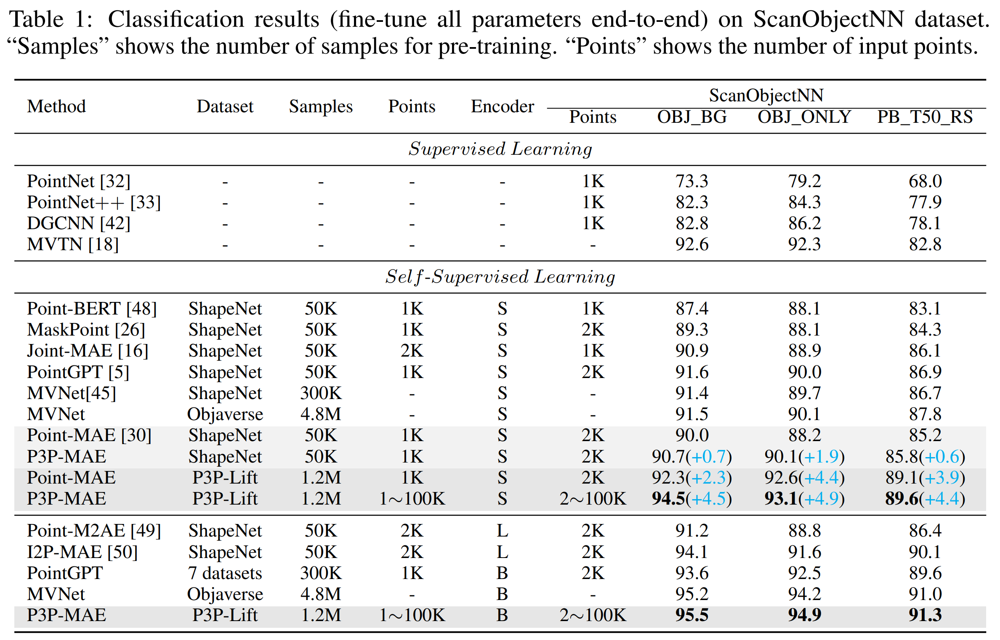

# P3P: Pseudo-3D Pre-training for Scaling 3D Voxel-based Masked Autoencoders [[arXiv]](https://arxiv.org/pdf/2408.10007)
Main idea:

3D pre-training is crucial to 3D perception tasks. Nevertheless, limited by the difficulties in collecting clean and complete 3D data, 3D pre-training has persistently faced data scaling challenges. In this work, we introduce a novel self-supervised pre-training framework that incorporates millions of images into 3D pre-training corpora by leveraging a large depth estimation model.

Main results:



## TODO List
- [x] Release checkpoints.
- [x] Release pre-training and evaluation code.
- [x] Release data.
- [x] Write pre-training instructions and check it.
- [ ] Write fine-tuning instructions and check it.

## Pre-training Data Preparation
Download "train_depth_v2.zip" at our hugging face [website](https://huggingface.co/datasets/XuechaoChen/P3P-Lift).
Download training set of ImageNet-1K at their [official website](https://www.image-net.org/download.php).
First, sign up and get the access to download dataset.
Second, download the "Training images (Task 1 & 2)." at https://image-net.org/challenges/LSVRC/2012/2012-downloads.php.

Extract them and organize as:
```
│YourDataPath/
├──train/
│   ├──n01443537_10430.JPEG/
│   ├──.......
├──train_depth_v2/
│   ├──n01443537_10430_img_depth.npy/
│   ├──.......
```

Change the "ROOT" in config file "cfgs/dataset_configs/Pseudo3D.yaml".

## Evaluation Data Preparation
Download ScanObjectNN raw dataset at their official [website](https://hkust-vgd.github.io/scanobjectnn/).
You need to register first.
Then download "object_dataset.zip" and files under "PB_T50_RS/" at [website](https://hkust-vgd.ust.hk/scanobjectnn/raw/) (The extracting issue can refer to [this](https://github.com/getao/icae/issues/6)).

Extract them and organize as:
```
│YourDataPath/
├──object_dataset/
│   ├──bed/
│   ├──door/
│   ├──.......
├──PB_T50_RS/
│   ├──bed/
│   ├──door/
│   ├──.......
```

Change the "ROOT" in config file "cfgs/dataset_configs/ScanObjectNN_objectbg_color.yaml".

## Pre-training Setup
Basic environment:
```
conda create -n p3pmae python=3.9 -y
conda activate p3pmae
conda install pytorch==2.4.1 torchvision==0.19.1 torchaudio==2.4.1 pytorch-cuda=12.4 -c pytorch -c nvidia
pip install -r requirements.txt
```

Install [pytorch_scatter](https://github.com/rusty1s/pytorch_scatter):
```
pip install torch-scatter -f https://data.pyg.org/whl/torch-2.4.1+cu124.html
```
You can install different versions according to your CUDA library.
Note that the CUDA version building pytorch_scatter should exactly match the CUDA version building pytorch.

Install our modified [stack-chamfer](https://github.com/justanhduc/stack-chamfer):
```
cd ./stack-chamfer
MAX_JOBS=8 python3 setup.py install
```

## Pre-train Models
Pre-train the P3P sparse small model:
```
bash pretrain_small.sh
```

Pre-train the P3P sparse base model:
```
bash pretrain_base.sh
```

## Fine-tune Models
Download the weights of our pre-trained model at https://huggingface.co/XuechaoChen/P3P-MAE.

...

## Citation
```
@article{chen2024p3p,
  title={P3P: Pseudo-3D Pre-training for Scaling 3D Masked Autoencoders},
  author={Chen, Xuechao and Chen, Ying and Li, Jialin and Nie, Qiang and Liu, Yong and Huang, Qixing and Li, Yang},
  journal={arXiv preprint arXiv:2408.10007},
  year={2024}
}
```

## Acknowledgement
This work is built upon [Point-BERT](https://github.com/Julie-tang00/Point-BERT).